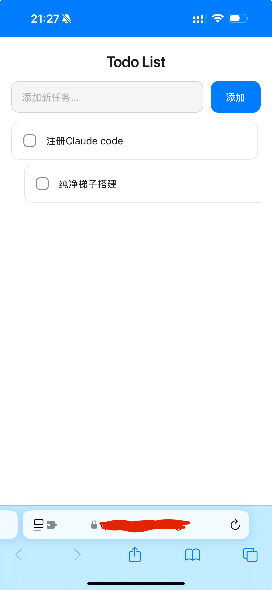

# Todo List 多端同步项目 🚀

> Language: [中文](README.md) | [English](README_EN.md)


## 效果图展示 👀

### 图 1：Windows 上显示的网页


### 图 2：微信小程序开发平台截图


### 图 3：手机上调试微信小程序界面


### 图 4：Safari 浏览器上效果



---

## 这个项目能做什么

- 在同一份数据上实现 Windows + iPhone + 网页同步
- 支持添加、编辑、勾选、删除、子任务
- 支持微信小程序壳（web-view 方案）
- 支持打包本地 Windows `.exe`

---

## 5 分钟跑起来（最短路径）

1. 安装 Node.js（建议 20）
2. 克隆仓库并安装依赖：

```bash
npm install
```

3. 配置 Supabase（见下一节）
4. 本地启动：

```bash
npm run dev
```

5. 浏览器打开本地地址，开始使用

---

## Supabase 配置（照抄即可）

官网链接：

- Supabase 首页：https://supabase.com/
- Supabase 控制台：https://supabase.com/dashboard

步骤：

1. 在 Supabase 新建项目
2. 打开 SQL Editor，执行：

```sql
create table if not exists todos (
  id uuid primary key default gen_random_uuid(),
  text text not null,
  completed boolean default false,
  parent_id uuid references todos(id),
  created_at timestamptz default now()
);

alter publication supabase_realtime add table todos;
```

3. 在 Project Settings -> API 复制：
   - Project URL
   - anon public key
4. 在项目根目录创建 `.env`：

```dotenv
VITE_SUPABASE_URL=你的ProjectURL
VITE_SUPABASE_ANON_KEY=你的AnonPublicKey
```

5. 运行：

```bash
npm run dev
```

---

## 部署方案（按你需要选一个）

### 方案 A：Vercel（默认推荐）

1. 推送到 GitHub
2. Vercel 导入仓库
3. Build command：`npm run build:web`
4. Output directory：`dist`
5. 环境变量：
   - `VITE_SUPABASE_URL`
   - `VITE_SUPABASE_ANON_KEY`
6. Deploy

适合：最快上线。

---

### 方案 B：Cloudflare Pages

1. Cloudflare -> Workers & Pages -> Create -> Pages -> Connect to Git
2. 选择仓库
3. Build command：`npm run build:web`
4. Build output directory：`dist`
5. 同样配置两个环境变量
6. Save and Deploy

适合：某些移动网络下可达性更稳。

---

### 方案 C：微信小程序（用现成壳）

使用目录：`wechat-miniapp`

1. 微信开发者工具导入 `wechat-miniapp`
2. 修改 `wechat-miniapp/miniprogram/app.js` 里的 `webUrl` 为你的线上 HTTPS 域名
3. 在微信公众平台配置合法域名/业务域名
4. 真机预览 -> 上传 -> 审核 -> 发布

---

### 方案 D：Windows 本地 EXE

打包：

```bash
npm run build:desktop
```

产物位置：`release/win-unpacked/Todo Widget.exe`

开发调试：

```bash
npm run dev:desktop
```

---

## iPhone 使用

1. Safari 打开你部署后的 HTTPS 地址
2. 测试任务编辑是否同步
3. 分享 -> 添加到主屏幕

---

## GitHub 新提交会自动更新吗

会（前提：Vercel/Cloudflare 项目是 Connect to Git）。

每次改完执行：

```bash
git add .
git commit -m "update"
git push
```

平台会自动触发新部署。

---

## 常见问题

### 1) 电脑能开，手机打不开

通常是网络或 DNS 问题，优先换部署域名（Vercel/Cloudflare 互换测试）。

### 2) 微信小程序 web-view 白屏

重点检查：

1. 业务域名是否配置
2. 是否 HTTPS
3. 域名校验文件是否部署成功

### 3) 多端数据不一致

检查是否都连接同一个 Supabase 项目（URL 和 key 要一致）。
